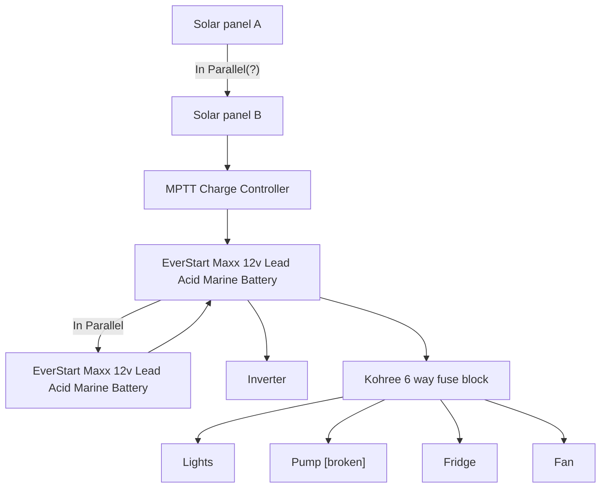

# Van wiring spec

Wiring spec for 2002 Chevy Express 3500 camper van build

```mermaid
flowchart TB
    A["Solar panel A"] -- In Parallel(?) --> B["Solar panel B"]
    B --> C["MPTT Charge Controller"]
    C --> D["EverStart Maxx 12v Lead Acid Marine Battery"]
    D -- In Parallel --> E["EverStart Maxx 12v Lead Acid Marine Battery"]
    E --> D
    D --> F["Inverter"]
    D --> G["Kohree 6 way fuse block"]
    G --> H["Lights"]
    G --> I["Pump [broken]"]
    G --> J["Fridge"]
    G --> L["Fan"]
```
